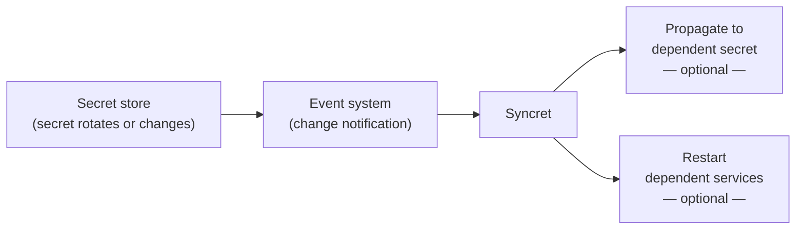

# Syncret

Syncret reacts to secret rotation and change events and automates two follow-up actions: propagating selected fields into a dependent secret, and forcing running services to restart with the latest values.

It ships as a minimal container image and runs as a serverless function triggered by your cloud provider's event system.

---

## The problem

When a secret rotates or changes, dependent secrets and running services need to react. Most teams solve this with untested, one-off glue code that never gets reused. Syncret standardizes that pattern into a single, configurable binary that covers the two most common follow-up actions.

---

## How it works



At least one of the two actions must be configured — they can also run together.

See [How it works](docs/how-it-works.md) for the full design.

---

## Provider support

| Provider | Secret store | Event trigger | Compute |
|---|---|---|---|
| **AWS** ✓ | Secrets Manager | EventBridge (CloudTrail) | ECS |
| Azure | Key Vault | Event Grid | Container Apps / ACI |
| GCP | Secret Manager | Pub/Sub | Cloud Run |

Azure and GCP support is planned. Contributions welcome.

---

## Quickstart — AWS

Set environment variables on your Lambda function and deploy the container image.

```bash
# Required — identifies which secret triggers Syncret
SYNCRET_SECRET_ARN=arn:aws:secretsmanager:us-east-1:123456789012:secret:my-secret-AbCdEf
SYNCRET_AWS_REGION=us-east-1

# Action 1 — propagate fields to a dependent secret (optional)
SYNCRET_TARGET_SECRET_ARN=arn:aws:secretsmanager:us-east-1:123456789012:secret:my-app-secret-XyZaBc
SYNCRET_TARGET_SECRET_KEYS=password          # or: password:DB_PASS  (src:dst remapping)

# Action 2 — restart ECS services (optional)
SYNCRET_ECS_FORCE_DEPLOY=true
SYNCRET_ECS_CLUSTER=my-cluster
SYNCRET_ECS_SERVICES=backend,worker
```

At least one action (`SYNCRET_TARGET_SECRET_ARN` or `SYNCRET_ECS_FORCE_DEPLOY=true`) must be set or Syncret will refuse to start.

→ [Full configuration reference](docs/configuration.md)  
→ [Step-by-step deployment guide](docs/deployment.md)

---

## Building from source

```bash
make build         # build binary (output: bin/syncret)
make test          # run tests with race detector
make cover         # run tests and show per-function coverage breakdown
make lint          # run golangci-lint
make tidy          # go mod tidy
make docker-build  # build multi-arch image (linux/amd64 + linux/arm64)
```

Requires Go 1.26+.

---

## License

Apache 2.0 — see [LICENSE](LICENSE).
