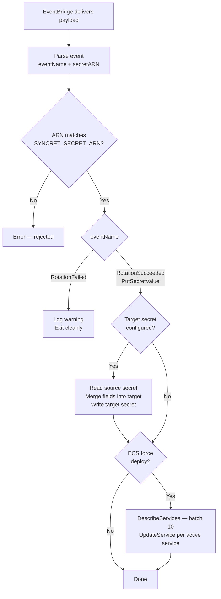

# How it works

## Design principles

**Event-driven and stateless.** Each Lambda invocation is independent. Syncret reads the event, performs the configured actions, and exits. No polling, no background tasks, no external state.

**Fire-and-forget for ECS.** Syncret calls `UpdateService` with `ForceNewDeployment=true` and does not wait for the deployment to stabilize. Monitoring deployment outcomes is out of scope and would unnecessarily extend Lambda execution time.

**Fail fast on configuration.** All environment variables are validated at startup. Syncret exits immediately with an actionable error message rather than failing silently mid-execution.

**No secrets in logs.** Secret values never appear in log output, error messages, or Lambda response payloads.

---

## Execution flow



---

## Internal structure

```
cmd/syncret/       → entrypoint: load config, init AWS clients, start Lambda handler
internal/config/   → env var loading and validation; exits on any missing/invalid value
internal/event/    → EventBridge/CloudTrail payload parser → typed Event struct
internal/handler/  → orchestration: parse → validate ARN → [secret update] → [ECS]
internal/aws/      → concrete AWS clients: SecretsManager, ECS
internal/logctx/   → slog.Logger propagation via context.Context
```

---

## Provider abstraction

The handler depends on two interfaces, not on AWS SDK types directly:

```go
type SecretsProvider interface {
    GetSecretString(ctx context.Context, arn string) (string, error)
    MergeAndPutSecret(ctx context.Context, targetARN string, sourceData map[string]any, keys []string) error
}

type ComputeProvider interface {
    ForceNewDeployment(ctx context.Context, cluster string, services []string) error
}
```

This makes the core logic testable without AWS credentials, and keeps the door open for alternative implementations.

---

## Multi-cloud roadmap

The v1 implementation targets AWS: Lambda as the runtime, EventBridge + CloudTrail as the event source, Secrets Manager as the secret store, and ECS as the compute target.

The provider interfaces are designed to accommodate other clouds without changing the handler logic:

| Layer | AWS (v1) | Azure (planned) | GCP (planned) |
|---|---|---|---|
| Runtime | Lambda | Azure Functions | Cloud Functions |
| Event source | EventBridge + CloudTrail | Event Grid | Pub/Sub |
| Secret store | Secrets Manager | Key Vault | Secret Manager |
| Compute | ECS | Container Apps | Cloud Run |

Multi-cloud support is tracked as a v2+ item. The handler, config, and event parser packages would remain unchanged — only new implementations of `SecretsProvider` and `ComputeProvider` are needed per cloud.

---

## Event parsing

Syncret handles two distinct CloudTrail event shapes:

**`RotationSucceeded`** — emitted by AWS as a Service Event. `requestParameters` is `null`; the secret ARN lives in `detail.additionalEventData.SecretId` (capital S).

**`PutSecretValue`** — emitted as an API Call. The secret ARN is in `detail.requestParameters.secretId` (lowercase s).

The parser resolves the ARN based on `eventName`, not `detail-type`, since `detail-type` has two valid values across the two use cases.

---

## ARN validation

After parsing, the handler rejects any event whose secret ARN does not match `SYNCRET_SECRET_ARN`. This is the primary defense against the EventBridge RDS rule, which fires on every `RotationSucceeded` in the account regardless of which secret rotated.

---

## Idempotency

**Target secret writes** use a `ClientRequestToken` derived from the target secret's current `VersionId`. If the same event is delivered twice by EventBridge (at-least-once delivery), both invocations produce the same token and the same `SecretString` — Secrets Manager treats the second write as a no-op.

**ECS redeployment** is idempotent at the ECS level. Calling `UpdateService` with `ForceNewDeployment=true` on a service that already has a deployment in progress is safe — ECS handles it correctly.
