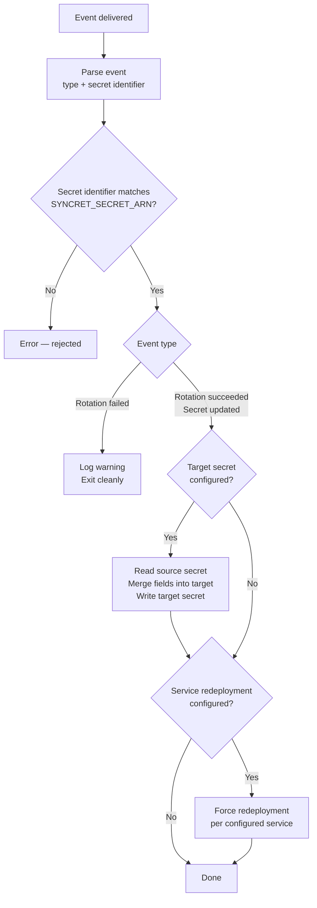

# How it works

## Design principles

**Event-driven and stateless.** Each function invocation is independent. Syncret reads the event, performs the configured actions, and exits. No polling, no background tasks, no external state.

**Fire-and-forget for service redeployment.** Syncret triggers a force redeployment and does not wait for it to stabilize. Monitoring deployment outcomes is out of scope and would unnecessarily extend execution time.

**Fail fast on configuration.** All environment variables are validated at startup. Syncret exits immediately with an actionable error message rather than failing silently mid-execution.

**No secrets in logs.** Secret values never appear in log output, error messages, or response payloads.

---

## Execution flow



---

## Internal structure

```
cmd/syncret/       → entrypoint: load config, init provider clients, start handler
internal/config/   → env var loading and validation; exits on any missing/invalid value
internal/event/    → event payload parser → typed Event struct
internal/handler/  → orchestration: parse → validate → [secret update] → [redeployment]
internal/aws/      → AWS implementation: Secrets Manager, ECS
internal/logctx/   → slog.Logger propagation via context.Context
```

---

## Provider abstraction

The handler depends on two interfaces, not on any provider SDK types directly:

```go
type SecretsProvider interface {
    GetSecretString(ctx context.Context, arn string) (string, error)
    MergeAndPutSecret(ctx context.Context, targetARN string, sourceData map[string]any, keys []string) error
}

type ComputeProvider interface {
    ForceNewDeployment(ctx context.Context, cluster string, services []string) error
}
```

This makes the core logic testable without provider credentials, and keeps the door open for alternative implementations.

---

## Idempotency

**Target secret writes** use a token derived from the target secret's current version. If the same event is delivered twice (at-least-once delivery is common in event systems), both invocations produce the same token and the same value — the second write is treated as a no-op.

**Service redeployment** is idempotent at the provider level. Triggering a force redeployment on a service that already has a deployment in progress is safe.

---

## Multi-cloud roadmap

The v1 implementation targets AWS: Lambda as the runtime, EventBridge + CloudTrail as the event source, Secrets Manager as the secret store, and ECS as the compute target.

The provider interfaces are designed to accommodate other clouds without changing the handler logic:

| Layer | AWS (v1) | Azure (planned) | GCP (planned) |
|---|---|---|---|
| Runtime | Lambda | Azure Functions | Cloud Functions |
| Event source | EventBridge + CloudTrail | Event Grid | Pub/Sub |
| Secret store | Secrets Manager | Key Vault | Secret Manager |
| Compute | ECS | Container Apps | Cloud Run |

Multi-cloud support is tracked as a v2+ item. The handler, config, and event parser packages would remain unchanged — only new implementations of `SecretsProvider` and `ComputeProvider` are needed per cloud.
