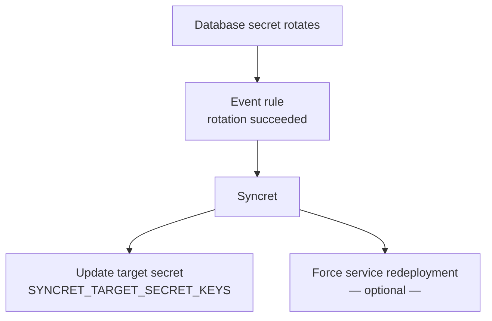
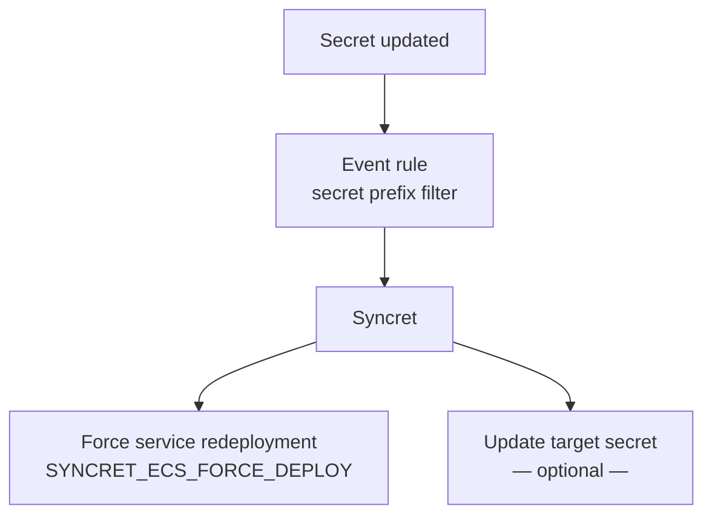

# Syncret

Syncret reacts to secret rotation and change events and automates two follow-up actions: copying selected fields from a changed secret into a target secret, and forcing dependent services to restart with the latest values.

Each action is independently optional — at least one must be configured.

---

## Use cases

### Database rotation

A managed database secret rotates on a schedule. Syncret copies the new credentials into an application secret so dependent services always have the current password. Service redeployment is optional — enable it when services cache the secret at startup rather than reading it on every request.

### App settings

An operator updates an application secret manually or via API. Syncret forces services to restart so they pick up the new values immediately. Updating a separate target secret is optional.

---

## Prerequisites

When service redeployment is enabled, Syncret only triggers restarts — it does not inject secrets into containers. Your services must already be configured to fetch the target secret at startup so they pick up the latest values when they restart.

When both actions are enabled, Syncret always updates the target secret before triggering redeployment — so restarting services read the latest values.

---

## Next steps

- [Reference](reference.md) — all environment variables
- [Deployment](deployment.md) — provider setup guides
- [How it works](how-it-works.md) — design and architecture
