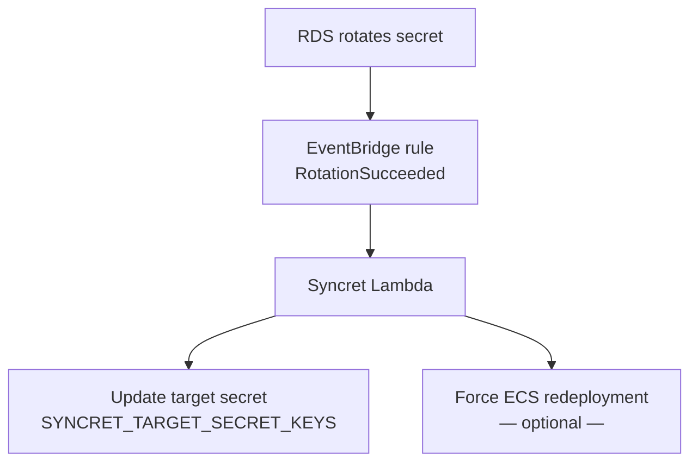
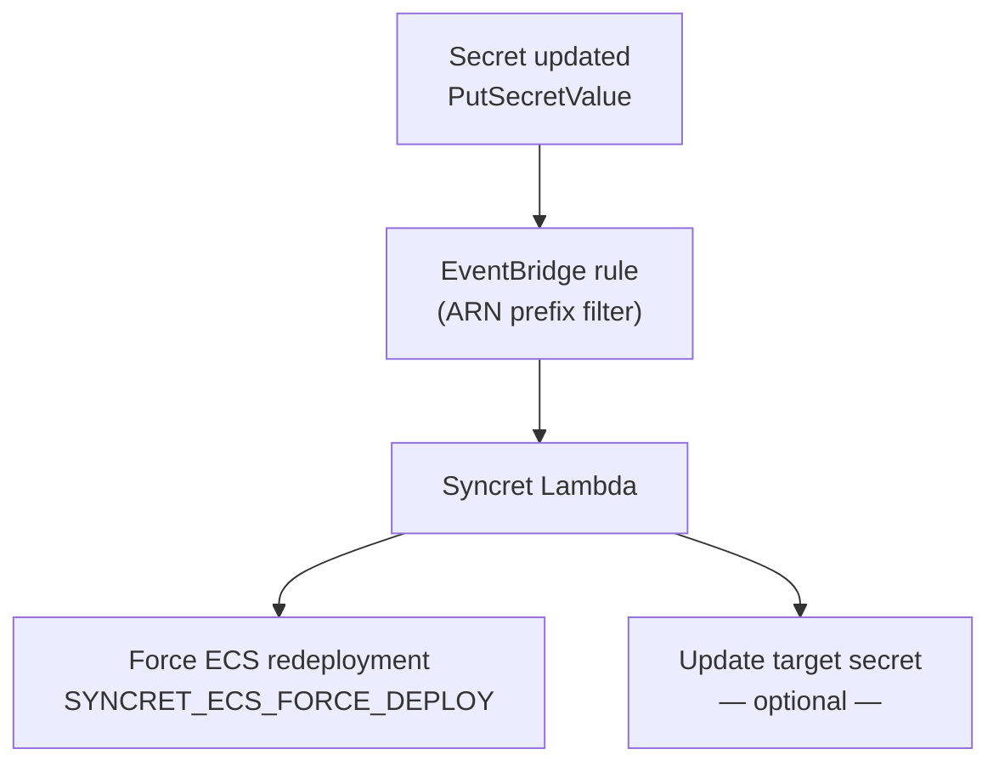

# Syncret

Syncret reacts to AWS Secrets Manager events and automates two follow-up actions: copying selected fields from a changed secret into a target secret, and optionally forcing ECS services to restart with the latest values.

Each action is independently optional — at least one must be configured.

---

## Use cases

### RDS rotation

RDS rotates a managed database secret on a schedule. Syncret copies the new credentials into an application secret so dependent services always have the current password. ECS redeployment is optional — enable it when services cache the secret at startup rather than reading it on every request.



### App settings

An operator updates an application secret manually or via API. Syncret forces ECS services to restart so they pick up the new values immediately. Updating a separate target secret is optional.



---

## Events

| Event | Source | Default action |
|---|---|---|
| `RotationSucceeded` | RDS managed rotation completed | Update target secret → optionally redeploy ECS |
| `PutSecretValue` | Secret written via API | Redeploy ECS → optionally update target secret |
| `RotationFailed` | RDS rotation failed | Log warning, no action |

Each use case requires its own Lambda function and EventBridge rule. One function per monitored secret.

---

## Prerequisites

If ECS force deployment is enabled, Syncret only triggers new task launches — it does not inject secrets into containers. Your ECS task definition must already reference the target secret so ECS fetches the latest value at container startup:

```json
{
  "containerDefinitions": [{
    "secrets": [{
      "name": "DB_PASSWORD",
      "valueFrom": "arn:aws:secretsmanager:us-east-1:123456789012:secret:my-app-secret-XyZaBc:password::"
    }]
  }]
}
```

When both actions are enabled, Syncret always updates the target secret before triggering ECS — so restarting tasks read the latest values.

---

## Next steps

- [Configuration reference](configuration.md) — all environment variables
- [Deployment guide](deployment.md) — IAM, ECR, Lambda, EventBridge setup
- [How it works](how-it-works.md) — design, architecture, multi-cloud roadmap
